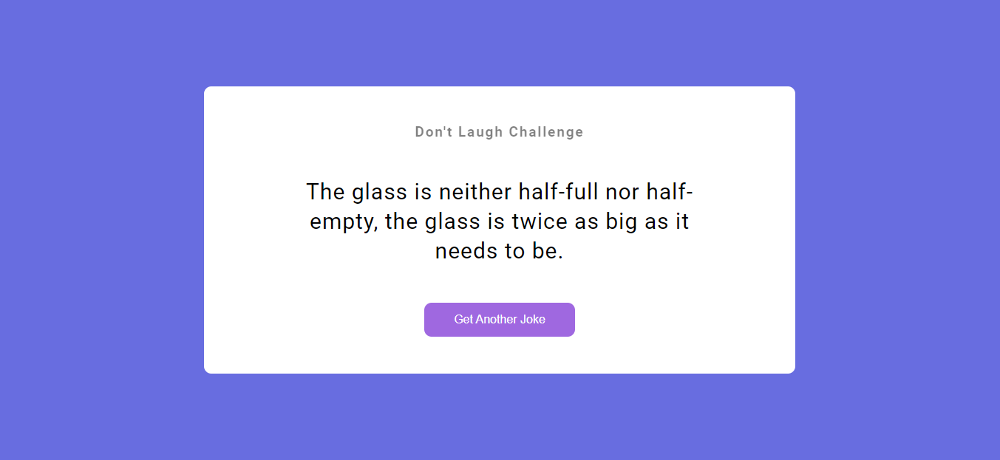
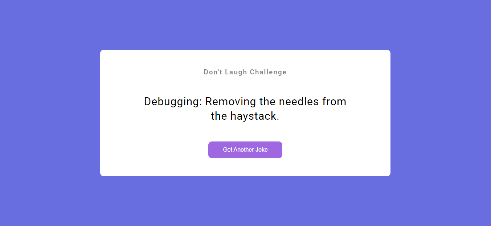

# PRANAV MATHUR

## Learnings from the project:

- Learned about **Fetch (API)**, _then()_ and _catch()_ blocks

## Time taken:

    It took me 3 hours to complete this project, which includes learning about Promises, Fetch and searching for a good jokes API.

## Screenshots:

## Live link:

[Go to site](https://15-joke-generator.netlify.app/)
